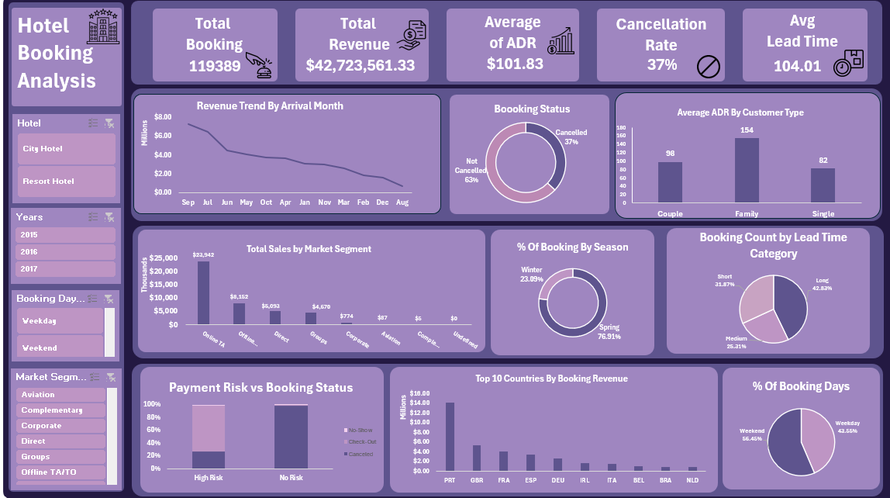

# Hotel Booking Analysis Dashboard (Excel)

## Project Overview

This project is an interactive Excel dashboard built to analyze hotel booking data. It provides insights into booking trends, customer behavior, revenue performance, and cancellation rates through interactive visualizations.

---

## Dashboard Preview

---

## KPIs

- Total Bookings
- Total Revenue
- Average ADR (Average Daily Rate)
- Cancellation Rate
- Average Lead Time

---

## Dashboard Features

- Interactive Slicers
  - Hotel
  - Year
  - Booking Day
  - Market Segment

- Revenue Trend Analysis
- Booking Status Distribution
- Average ADR by Customer Type
- Revenue by Market Segment
- Seasonal Booking Analysis
- Lead Time Category Analysis
- Top 10 Countries by Booking Revenue
- Payment Risk vs Booking Status

---

## Tools Used

- Microsoft Excel
- Pivot Tables
- Pivot Charts
- Slicers
- Conditional Formatting
- Data Cleaning
- Calculated Columns

---

## Key Insights

- City Hotels generated the majority of bookings.
- Online Travel Agencies produced the highest revenue.
- Families recorded the highest Average ADR.
- Approximately 37% of bookings were cancelled.
- Spring had the highest booking percentage.
- Portugal generated the highest booking revenue.

---

## Skills Demonstrated

- Data Cleaning
- Data Analysis
- Dashboard Design
- Data Visualization
- Business Reporting
- Excel Analytics
